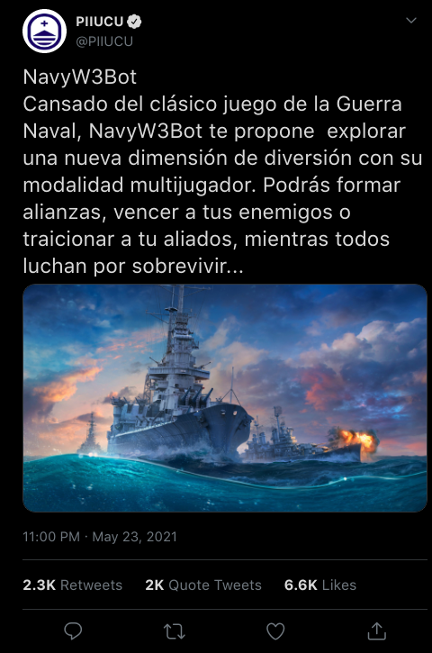

## NavyW3Bot
 

 
### Consigna
 
El chatbot se basa en el clásico juego de _"Guerra Naval"_, pero con algunas modificaciones 😉. #NavyW3Bot
 
#### Desarrollo
 
NavyW3Bot esta basado en el ya conocido juego de la guerra naval. Para el desarrollo de este Bot, proponemos una versión multijugador en donde 2 o más Jugadores compiten entre sí para hacerse con el control de los mares. Para ellos vamos a tener una cantidad limitada de barcos que podremos ubicar en nuestro "territorio marítimo".
 
#### Especificaciones
 
##### Zona de Guerra
 
La "zona de guerra" o tablero debe ser de 14 X 26 dentro de esta podremos encontrar distintos tipos de barcos así también como ítems especiales.
 
##### Flota 
 
Existen 6 tipos de embarcaciones distintas
 
- 🚢 **Acorazado**: Este es uno de los barcos más avanzados y poderosos de la flota. Cada vez que este dispara hacia su objetivo lanza dos misiles más a posiciones aleatorias del tablero enemigo. Posicionamiento = 6 lugares en el tablero.
 
- ⛴ **Crucero ligero**: Es Capaz de disparar tanto misiles como cargas de profundidad que destruyen a los submarinos. Posicionamiento = 5 lugares en el tablero.
 
- 🚤 **Submarino**: El temor de los mares inmune a los disparos convencionales(misiles), es capaz de realizar dos tipos de disparos, un misil y una carga de profundidad. La única manera de destruirlo es mediante cargas de profundidad. Posicionamiento = 4 lugares en el tablero.
 
- 🛳 **Crucero Pesado**: Capaz de recibir dos ataques por cada una de sus secciones es el más resistente de los barcos. Cada vez que se ataca con este barco el mismo dispara dos misiles a la misma posición de ataque.
Posicionamiento = 3 lugares en el tablero.
 
- 🛥 **Fragata**: Es el más frágil de la flota, pero que esto no te preocupe, puede disparar hasta 4 misiles por turno, 2 de ellos a una posición aleatoria.
Posicionamiento = 2 lugares en el tablero.
 
- ⛵ **Pontón**: Es un barco que no puede realizar ningún ataque pero con el equipamiento correcto puede ser muy útil. Posicionamiento = 1 lugares en el tablero.

Los barcos pueden posicionarse tanto verticalmente como horizontalmente, no pueden compartir la misma posición en el tablero y además deben de tener una separación de almenos 1 posición con otro barco.

##### Equipamiento
 
Cada uno de los barcos pueden ser equipados con distintos ítems:
 
- 🛰 **Bloqueo satelital**: Permite desviar el disparo a una posición aleatoria del tablero. Únicamente se podrá tener 1 de este tipo de items.

- 🛡 **Blindaje**: La parte del barco que este equipado con este item puede resistir un disparo más.
 
- 🚀 **Misil antiaéreo**: Solo puede haber 1 equipamiento de este tipo por barco y se activará en caso de que cualquier parte del barco sea atacada.
  
 - 🦍 **Kong**: El mundo ha cambiado y hemos visto el poder de los amos del mundo **los titanes**. El barco que esté equipado con Kong será inmune al ataque del titan alfa Godzilla. El equipamiento de Kong está restringido a barco de más 4 posiciones que no tengan ningún equipamiento. Además el barco que esté equipado con kong, podrá atacar cada dos turnos. Y mientras esté equipado con kong, el barco no podrá ser equipado con ningún otro ítem.

- 🕵️ **Hackers**: Este equipo de expertos pueden operar únicamente sobre un pontón y son especialistas en el hackeo de satelites, esta habilidad nos permitirá 1 vez cada 4 rondas espiar 2 posiciones de cada enemigos.

Los items de equipamientos seran asigandos de forma aleatoria en cada ronda y el jugador decidira si equipar a un barco o descartarlo.
 
Una vez que se activen los items estos serán eliminados del barco.
 
 
##### Eventos Catastróficos

La Naturaleza es impredecible y puede que nos juegue una mala pasada algunos de los eventos catastróficos que pueden ocurrir son los siguientes :
 
- ☄️ **Lluvia de meteoritos**: Una vez que se desata el evento en la ronda todos los tableros recibirán ataques aleatorios.
  
 - 🌋 **Volcán submarino**: En el caso de que explote un volcán submarino, va a destruir completamente a cualquier barco a su alrededor.
 
- 🦖 **Godzilla**: La aparición de este Titan implica una destrucción completa de cualquier barco que se encuentre a una posición de 3 casilleros del titán, a excepción del barco que esté equipado con kong.
 
- 🌪️ **Tornado**: Dañara las secciones de los barcos que se encuentren en su misma latitud y longitud.
 
 
Se debe tener en cuenta que el día de mañana podemos llegar a querer agregar nuevos items de equipamiento como desastres naturales.
 
##### Alianzas
 
Podemos en nuestro turno enviar una solicitud de alianza a cualquiera de los jugadores. Una alianza en el juego implica que puedo utilizar los barcos de mi aliado para atacar a nuestros enemigos en común así también como el aliado podrá utilizar los nuestros. Podremos tener un único aliado en toda la partida.
 
##### Traidor!
 
Podemos en cualquier momento traicionar a nuestro aliado, pero aquel que rompa la alianza tendrá luego de la traición una penalización de 1 turno sin jugar, en donde podrá ser atacado.
 
##### Victoria
 
Sin dudas que el último que tenga alguna sección de algún barco en pie será declarado ganador y señor de los mares, pero podría pasar que debido algún evento catastrófico, no queden jugadores en pie, dado este caso se debe asignar alguna puntuación arbitraria a los jugadores que nos permitan determinar el ganador de la partida en este caso.
 
Para el cálculo de puntos se debe tener en cuenta la cantidad de disparos que se realizaron y se recibieron, los items equipados, la cantidad de disparos acertados/fallidos,
y las catástrofes que el jugador tuvo que resistir.
 
Al final del juego todos los jugadores deberían de poder ver en qué posición del juego terminarón.

##### Ejemplo de eventos: **Godzilla Vs Kong**.

1. Dado el Siguiente escenario aparece **Godzilla** 🦖 en nuestra zona de guerra y destruye los barcos que se encuentran a tres posiciones de él. Como podemos ver nuestro barco mas grande esta equipado con el item **Kong** 🦍 , este barco no será afectado por el efecto de **Godzilla**.

    🌊🌊🌊🌊🌊🌊🌊🌊🌊🌊🌊🌊🌊 
    🌊🌊🌊🌊🌊🌊🌊🌊🌊🌊🌊🌊🌊 
    🌊🌊🌊🌊🌊🌊🌊🌊🌊🌊🌊🌊🌊 
    🌊🌊🌊🌊🌊🌊🚢🚢🚢🚢🦍🚢🌊 
    🌊🌊🌊🌊🌊🌊🌊🌊🌊🌊🌊🌊🌊 
    ⛴️⛴️⛴️🌊🌊🌊🌊🌊🌊🌊🌊🌊🌊 
    🌊🌊🌊🌊🌊🌊🦖🌊🌊🌊🌊🌊🌊 
    🌊🌊🌊🌊🌊🌊🌊🌊🌊⛴️⛴️⛴️🌊 
    🌊🌊🌊🌊🌊🌊🌊🌊🌊🌊🌊🌊🌊 
    🌊🌊🌊🌊🌊🌊🛥️🌊🌊🌊🌊🌊🌊 
    🌊🌊🌊🌊🌊🌊🛥️🌊🌊🌊🌊🌊🌊 
    🌊🌊🌊🌊🌊🌊🌊🌊🌊🌊🌊🌊🌊 

2. Se desata el evento catastrofico
   
    🌊🌊🌊🌊🌊🌊🌊🌊🌊🌊🌊🌊🌊 
    🌊🌊🌊🌊🌊🌊🌊🌊🌊🌊🌊🌊🌊 
    🌊🌊🌊🌊🌊🌊🌊🌊🌊🌊🌊🌊🌊 
    🌊🌊🌊🔥🔥🔥🚢🚢🚢🚢🦍🚢🌊 
    🌊🌊🌊🔥🔥🔥🔥🔥🔥🔥🌊🌊🌊 
    ⛴️⛴️⛴️🔥🔥🔥🔥🔥🔥🔥🌊🌊🌊 
    🌊🌊🌊🔥🔥🔥🦖🔥🔥🔥🌊🌊🌊 
    🌊🌊🌊🔥🔥🔥🔥🔥🔥❌❌❌🌊 
    🌊🌊🌊🔥🔥🔥🔥🔥🔥🔥🌊🌊🌊 
    🌊🌊🌊🔥🔥🔥❌🔥🔥🔥🌊🌊🌊 
    🌊🌊🌊🌊🌊🌊❌🌊🌊🌊🌊🌊🌊 
    🌊🌊🌊🌊🌊🌊🌊🌊🌊🌊🌊🌊🌊 
    🌊🌊🌊🌊🌊🌊🌊🌊🌊🌊🌊🌊🌊 

3. Finaliza el evento dejando como resultado el siguiente tablero.

    🌊🌊🌊🌊🌊🌊🌊🌊🌊🌊🌊🌊🌊 
    🌊🌊🌊🌊🌊🌊🌊🌊🌊🌊🌊🌊🌊 
    🌊🌊🌊🌊🌊🌊🌊🌊🌊🌊🌊🌊🌊 
    🌊🌊🌊🌊🌊🌊🚢🚢🚢🚢🚢🚢🌊 
    🌊🌊🌊🌊🌊🌊🌊🌊🌊🌊🌊🌊🌊 
    🔥🔥🔥🌊🌊🌊🌊🌊🌊🌊🌊🌊🌊 
    🌊🌊🌊🌊🌊🌊🌊🌊🌊🌊🌊🌊🌊 
    🌊🌊🌊🌊🌊🌊🌊🌊🌊🔥🔥🔥🌊 
    🌊🌊🌊🌊🌊🌊🌊🌊🌊🌊🌊🌊🌊 
    🌊🌊🌊🌊🌊🌊🔥🌊🌊🌊🌊🌊🌊 
    🌊🌊🌊🌊🌊🌊🔥🌊🌊🌊🌊🌊🌊 
    🌊🌊🌊🌊🌊🌊🌊🌊🌊🌊🌊🌊🌊 

### Plataforma
 
El bot debe poder ser utilizado desde distintas plataformas de chat (por ejemplo, Telegram, WhatsApp, Messenger, etc.). Es necesario integrarlo al menos con una de ellas.
 
### Completitud de la Consigna
 
Esta consigna es parcialmente completa. Naturalmente, durante el desarrollo del proyecto surgirán interrogantes sobre la especificación del bot. Dichas consultas serán evacuadas por el _product owner_ de este proyecto: Eduardo Pérez.
 
 
----

🌎  **¡El mundo necesita este bot! Es ahora tarea de ustedes hacerlo realidad.** 👨‍💻👩‍💻

---
 

 
##### Proyecto 2021 - Primer Semestre - Letra
###### FIT - Universidad Católica del Uruguay
 

